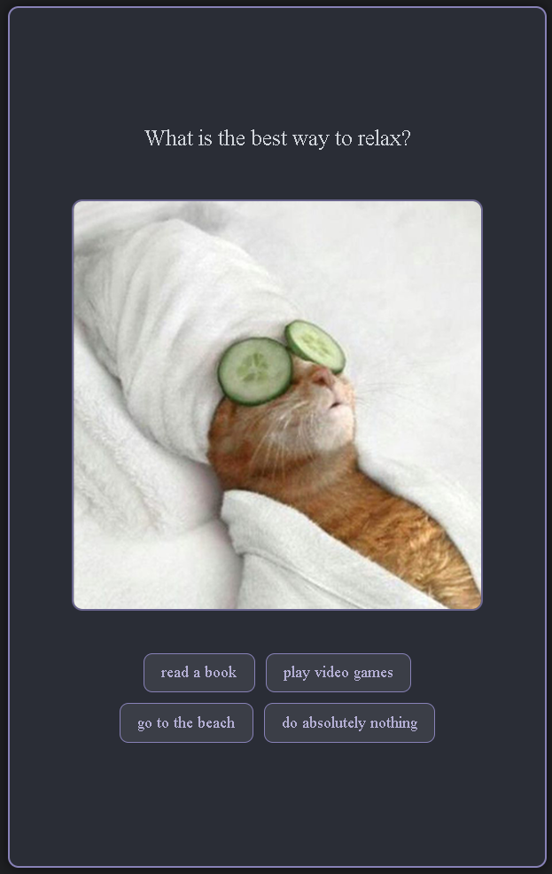

# Little Quiz

## Dynamic Button Addition

In this project, we'll be going through how to dynamically add buttons to a personality quiz about cats!

The user will answer questions to find out what type of cat they are! There are 5 options, "angry", "shocked", "singing", "soldier", and "what" cats!

## Step-by-Step Guide

### Understand how the code works
Let's first take a look at `data.js`. 

```javascript
export let questions = [
    {
        id:0, // First question
        text: "What is the best way to relax?",
        image: "lil_images/story/relax.png",
        choices: {
            "read a book": ["what", "singing"],
            "play video games": ["soldier", "angry"],
            "go to the beach": ["shocked", "singing"],
            "do absolutely nothing": ["angry", "shocked"]
        }
    },
    {
        id:1,
        text: "What is your favorite color?",
        image: "lil_images/story/rainbow.png",
        choices: {
            "blue": ["singing", "what"],
            "yellow": ["angry", "shocked"],
            "red": ["soldier", "what"],
            "some mixture of the above": ["soldier", "singing"]
        }
    },
    ...
    ...
```

This is the data for one of the quiz options, let's break it down.

```javascript
export let questions = [
```

`questions` is an **array**. Let's take a look at what it contains:

Inside the ``questions`` array is an object, you can tell because it uses a `{` curly brace and has properties. Let's understand what the properties are for.

- `id:0`
  - The `id` property keeps track of the order of questions. The next question will have an id of 1, then 2, then so on.
- `text: "What is the best way to relax?"`
  - The `text` property is the question being asked.
- `image: "lil_images/story/relax.png"`
  - The `image` property is the filepath to the image to be paired with the question.
- `choices: {`
  - The choices property is actually another object with its own properties!
    - `"read a book": ["what", "singing"]`
      - The property is the answer choice, while its value is an array of the personalities that it counts towards.
      - Picking this answer will add points to the "what" and "singing" personality.

If you wanted to log "what" from the `questions` object into the console, you would do:

```javascript
console.log(questions[0].choices["read a book"][0]);
```

Keep in mind that `questions` is an **array** of **objects**, and one of the object's properties is **another object**.

### Personalities List
This is the code for the personalities.

```javascript
export let personalities = {
    "angry": 0,
    "what": 0,
    "soldier": 0,
    "singing" : 0,
    "shocked" : 0,
};
```

`personalities` is an **object** with five properties which are the different personalities the user can get. They all have a score of 0, and the score will go up whenever the user chooses an option that matches the personality. At the end of the quiz, the personality with the highest score is what the user will get!

## Let's write the code!

We need to fill our page with our question data! We need to make the process reusable so we can use it for any question! We'll edit the code in `mainQuiz.js`.

✅ Make sure you're in `mainQuiz.js`, and **not** in `data.js`!

Your job is to complete the `loadQuestion(ID)` function, which, if called with the ID of the question to load, loads that question into the website, alongside its picture and buttons for each of the choices.

```javascript
// Let's complete this function
function loadQuestion(ID) {
    // The loadQuestion function should update the text, images, and buttons of the question with the ID given.
```

### Step 1: Grabbing HTML elements
This is a snippet of the HTML for our page:
```xhtml
<div class="game-container" id="game-container">
    <div class ="question-text" id="question-text"></div>
    <div class="image-container">
      
    </div>
    <div class="choices" id="choices"></div>
  </div>
```
Since this function is supposed to update and change things on the page, we'll need to grab a couple things from the HTML: The question-text, the question-image, and choices div.

✅ Under `//Step 1`, Store three things into variables:
  - The 'question-text' element
    - This has been done for you.
  - The 'question-image' element
  - The 'choices' element


### Step 2: Changing the HTML elements
Now, lets update the page by editing the elements we just grabbed.

We need to put our text from the question into our `questionText` element. Remember, `questions` is an **array** of objects, and we're looking for a property from one of those objects. In order to do this, we'll need to know from which question in the array we're getting the text from. Luckily, look at our function definition:

```javaScript
function loadQuestion(ID) {
```

It has a parameter called `ID` that should be the ID of the question we're looking for in the array! `questions[ID]` is the object we're looking for here! Since we want the text of that object, we'll need to do `questions[ID].text` to get the question text we want!

✅ Under `//Step 2`, update:
  - Your question text variable's innerHTML to the `text` property from the correct object in the `questions` array.
    - This has been done for you.
  - Your question image variable's src to the `image` property from the correct object in the`questions` array.

### Test it!

Try testing out the website so far to see if it's working. If you press the Start button on the website, you should be able to see question 1's text and image. If you don't see anything, double check your code and read the instruction carefully, and ask a mentor if you get stuck!


✅ Your website shows the first question's text and image when clicking start.


### Step 3: Create the choice buttons

Let's take another look at the `questions` array:

```javaScript
export let questions = [
    {
        id:0, // First question
        text: "What is the best way to relax?",
        image: "lil_images/story/relax.png",
        choices: {
            "read a book": ["what", "singing"],
            "play video games": ["soldier", "angry"],
            "go to the beach": ["shocked", "singing"],
            "do absolutely nothing": ["angry", "shocked"]
        }
    },
```

The choices property is an object with four properties. This means we need to create four buttons for the user to press. In order to do this, we'll need to use a loop in order to loop through each choice. We have not taught how to do this yet, so the loop statement is already done.

```javascript
for (const [choice, personality] of Object.entries(questions[ID].choices)) {
  // Step 3
}
```

This line looks complicated, so to break it down:
- All the code inside of the `for` loop will run once for every choice there is. For the first question, this code will run 4 times.
- There are two variables that differ for each time the code loops: `choice` and `personality`
- `choice` is the property, while `personality` is the value.
  - `choice` is a string, for example `"read a book"` or `"play video games"`.
  - `personality` is an **array** of personalities that fit that choice, for example `["what", "singing"]`
    - So if I were to click the `"read a book"` button, it adds points to the `"what"` and `"singing"` personalities.


Inside the loop, we want to create a new button, which means also setting up it's `innerHTML` and CSS class.

✅ Under `// Step 3`,
- Create a new button
  - 
- Change its `innerHTML` to the `choice` variable
- Change its `className` to `"choice-button"`

### Step 4: Add the button to the HTML

In order to test if our loop works, let's append the buttons we're making to the HTML.

We want to append the button to the `choices` div, which we stored in a variable in Step 1.

✅ Under `// Step 4`,
- Use `appendChild()` to append the new button to the `choices` div variable you made from Step 1
  - Example usage of `appendChild()`, if you forgot:
  - 
  - (This is not the answer!)

### Test it!

Now let's test our website again. When we press the start button, we should have four buttons that are the choices for the user to click on. If you don't see the buttons, double check your code and read the instruction carefully, and ask a mentor if you get stuck!



✅ Your website shows the four choice buttons. Clicking on them does not do anything yet.

### Step 5: Making the buttons do something

Later in the code is a function called `changeQuestion()` that we want to call when the button presses. Specifically, we want the code `changeQuestion(currentQuestion + 1, personality);` to run only when the button is clicked.

✅ Do not copy and paste this line into the code, not yet.

To do this, we'll add an **event listener** to our button, that will listen for a click. When clicked, it should run that code. Let's recall what the code for adding an event listener looks like:


✅ Under `// Step 5`,
- Give the button an event listener that runs the code `changeQuestion(currentQuestion + 1, personality);` when clicked

### Test it!

Now when we press one of the button choices, it should load the next question along with its picture and choices.


But wait a minute! The next question should only have four choices, but this one has eight? We forgot to clear the last buttons before adding the new ones in!

### Step 6: Fixing the button spam

Every time we load the question, we're appending buttons to the `choices` variable, but we never remove the old ones. This is easy to fix, all we have to do is empty the innerHTML of `choices` before adding the next buttons!

✅ Under `// Step 6`,
- Set the innerHTML of the choices divider to an empty string (`""`) **before** the loop that adds the new buttons
- Test it!


## Conclusion

Congratulations! The neat part about working with arrays and objects is that if you want to add new questions, you don't have to write any more code! All you have to do is edit the data.js file to change the test!
